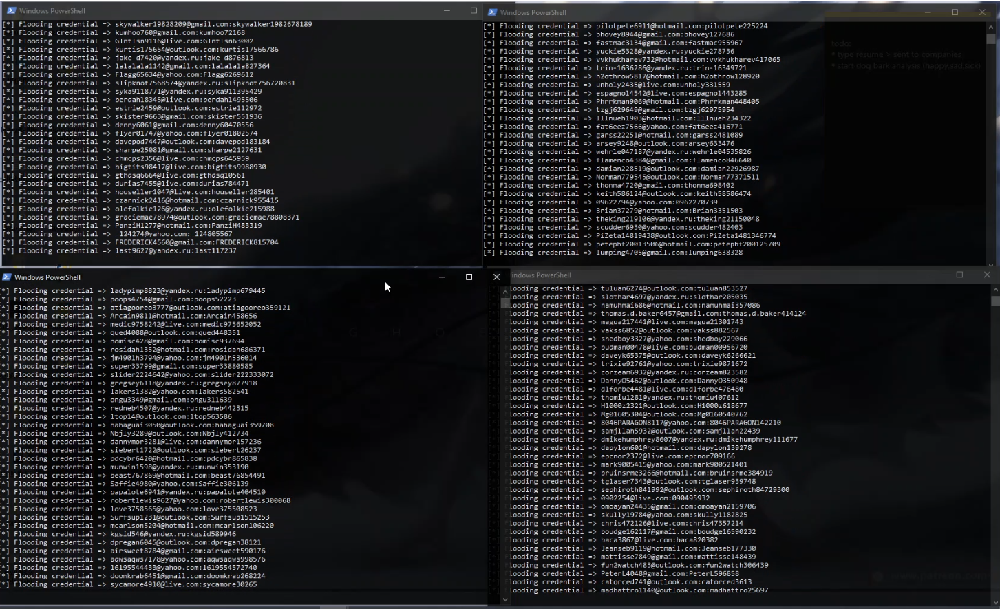

# Phisher_Flooder
 Flood the phisher database with fake credentials

 ## Usage:
 ```
 python3 ./floodPhisher.py
 ```

 ## Tips:
 If you want to change the usernames with your own usernames, you can just edit the content in the usernames.txt file.

 ## Result on Flooding:
 

 ## YouTube Video on Demo:
 https://youtu.be/K2WOh5JYEhY

 